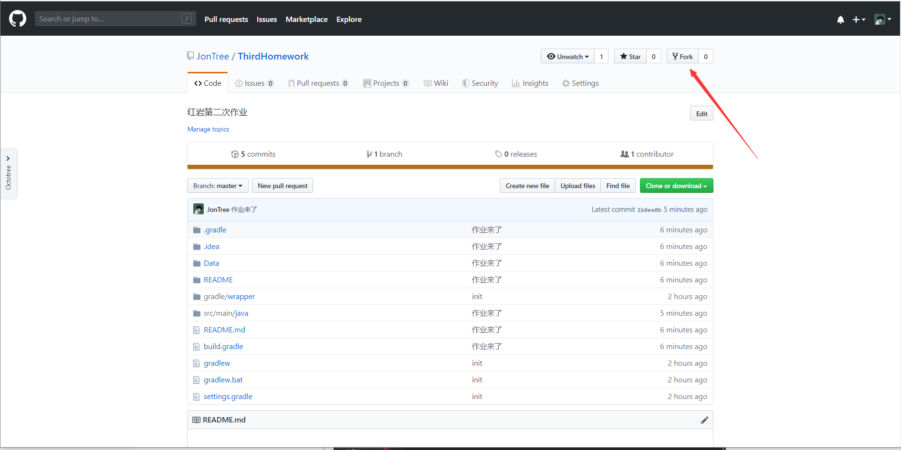

# ThirdHomework介绍
笔试做的是B卷的同学还记得这道题目吗？

```
小D学长负责安排值班，需要把一些人安排在一张值班表上，但是大多数人并不是所有时间都有空，每个人的情况都有所不同（比如有的时间段不能去），他太难了，简直快疯了，请你救救小D学长，帮忙设计一个排班的思路，可以尽量让所有人都被安排上，并且尽量让所有时间段都有人值班（情况示例：周一到到周五，假如每天有四个时间段需要安排人值班，一个时间段最多只能有两人，每个人只能被只能被安排两次，一共有20人，且这20个人各自的情况足够随机的且是可以被安排在这张表上的）（有一定思路即可酌情给分哦，解决给出的示例情况即可得满分。大鸽就直接解决通用情况吧，但是没有实际卷面加分哦（即一个学生能被安排的次数为m，时间段所能被安排的人数为n））
```

我记得当时貌似还是很多同学写出思路了呀，现在需要你们来实现这样一个算法。

## 做作业步骤

* 把整个项目fork到你的github

  

* 在你想存的文件夹项目的文件夹使用git bash将整个工程拉下来

```bash
git clone https://github.com/你的github名/ThirdHomework.git
```

进入到你fork的


* 使用idea打开这个项目

* 等待idea完成项目构建

* 构建完成之后开始你的艰苦一周

* 主程序在这里，data包里面是我给你提供的需要排班人员数据，这里我已经提前给你生成了Data的对象

  > 

## 给定数据说明

* Data类和数据使用说明

  Data中你会用到的只有一个成员变量也就是`datas`里面有我为你准备的所有需要排版的人员的数据

  **如何取得**`datas`？

  ```java
  Data data = new Data();//初始化实例化一个Data的对象
  data.datas//直接使用Data的实例就可以取得datas
  ```

  datas如何使用？

  * datas里面有4组数据，任选一组去实现排班即可，给你四组是让你确认你写的算法是否适用所有足够随机的且是可以被安排在这张表上的

    ```java
    //例如我们现在需要取得第一组数据
    data.datas.get(0);
    //以下说明一下datas你可能会用到的一些方法和属性
    datas.get(索引参数);//get用来取得里面的数据，索引同样和数组一样从0开始
    datas.size();//取得里面数据的个数
    ```

  * 一组具体数据的说明

    ```java
    //例如这里我们取得的是上面的第一组数据，并且我们把这组数据存下来为students
    ArrayList<Student> students = data.datas.get(0);//前面那个类型具体是什么可以不用在意，自己感兴趣可以去了解，这其实就是你们上一个作业里那个可以自动扩张的动态数组，只是现在里面的数据类型是Student
    
    //一些属性和方法详解
    students.get(索引参数);//get用来取得里面的数据，索引同样和数组一样从0开始
    students.size();//同上，获得里面到底有多少个元素，类似于数组的length
    ```

  * 取得具体的学生元素和学生元素里面的数据说明

    ```java
    //上面的students取得的是具体的学生类对象，例如我们也取第0个
    Student student = students.get(0);
    
    student.getName();//取得这个人的名字
    student.getSuitableTurns();//取得这个人可以去值班的所有时间段的集合，用法同上
    ```

  * 空闲时间说明

    ```java
    //假如你利用上面的student取得了他第一个可以去值班的时间段（也就是第0个索引）
    Turn turn = student.getSuitableTurns().get(0);
    
    turn.getWorkDay();//这个时间段在星期几（1就是星期一，2就是星期二以此类推）
    turn.getDayTime();//这个时间段在这一天的第几个时间段（一天有四个时间段，分别是1，2，3，4）
    
    ```


你需要实现一个算法，将这些同学合理的排到班次上：

情况示例：

周一到到周五，假如每天有四个时间段需要安排人值班，一个时间段最多只能有两人，每个人只能被只能被安排两次，一共有20人，且这20个人各自的情况足够随机的且是可以被安排在这张表上的

以上给出的数据都是可以排到一张表的。

排完之后把每个班次里面是那些人输出出来。

### 完成作业之后

请提交pull requests到我的仓库 （怎么提，百度）